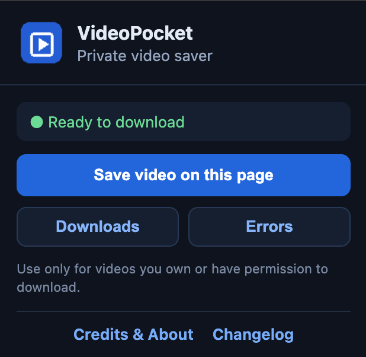
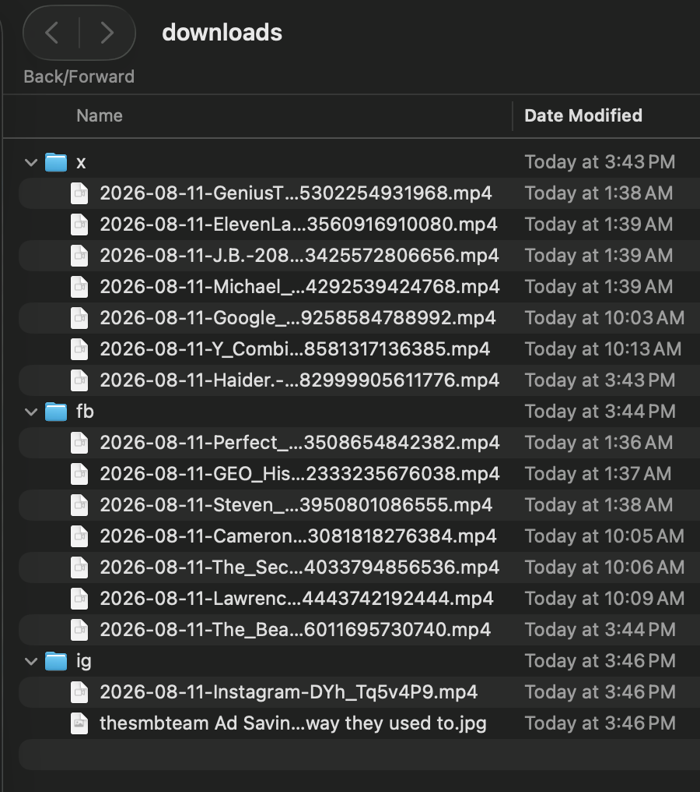

# VideoPocket

A private Chrome extension that saves videos and images you own or have permission to download from X, Facebook, Instagram, LinkedIn, and YouTube. Direct media files download in Chrome. Segmented streams are handed to an optional local Mac helper and never sent to a third-party service.

**Imagined by Mohammed Kabir. Developed by his agents.**

[Download VideoPocket v0.4.6](https://github.com/evoknow-ai/videopocket/releases/tag/v0.4.6) · [Changelog](CHANGELOG.md) · [Kabir's website](https://eatsleepai.us)

## Download

Download the latest signed and notarized Mac installer and Chrome extension from the [VideoPocket v0.4.6 release](https://github.com/evoknow-ai/videopocket/releases/tag/v0.4.6):

- **Mac:** `VideoPocket-Mac-0.4.6.dmg`
- **Chrome extension:** `VideoPocket-Extension-0.4.6.zip`

## Screenshots

### Extension

### Organized downloads

VideoPocket keeps media organized by source in dedicated X, Facebook, and Instagram folders.

## Install the Chrome extension

1. Download and unzip `VideoPocket-Extension-0.4.6.zip`.
2. Open `chrome://extensions` in Chrome.
3. Enable **Developer mode**.
4. Click **Load unpacked** and select the unzipped `extension` folder.
5. Open a supported site. A **Save video** or **Save image** button appears over detected media.

## Install the Mac helper

The helper improves Facebook, Instagram, X and YouTube support by combining separate audio and video streams into an MP4.

1. Open `VideoPocket-Mac-0.4.6.dmg`.
2. Double-click **Install VideoPocket**.
3. Follow the visible installation progress until it confirms completion.

That is all. The Chrome extension pairs automatically. Python, yt-dlp, and FFmpeg are bundled, so users do not need Terminal, Homebrew, or a separate runtime.

Downloads are saved under `~/Downloads/VideoPocket`. Change this in `helper/config.json` after its first launch.

Completed videos are normalized to H.264 video and AAC audio. Rotation is applied to the pixels and cleared from the metadata for reliable playback in QuickTime, Finder, browsers, and mobile devices.

## Privacy and security

- There is no remote VideoPocket server.
- The helper listens only on `127.0.0.1` and requires a random token.
- Only an allowlist of supported HTTPS domains is accepted.
- Playlists are disabled to prevent accidental bulk downloads.
- Browser cookies are not exported to the helper in this version.

## Known limitations

- Sites frequently change their markup and delivery systems, so adapters will occasionally need updating.
- Private or age-restricted media may not download because browser cookies are intentionally not copied.
- DRM-protected video is not supported.
- Chrome Web Store distribution may be restricted; this project is intended for private, unpacked installation.
- You are responsible for complying with copyright law and each platform's terms.

## Troubleshooting

- **Helper offline:** reinstall the latest Mac helper from the DMG and reload the extension.
- **Direct download fails:** install or start the helper so VideoPocket can use the post URL.
- **No button:** reload the page after installing the extension and start playback once.
- Use **Errors** in the extension popup to view recent helper failures.

## Credits

VideoPocket was imagined by Mohammed Kabir and developed by his agents. Released under the MIT License.
